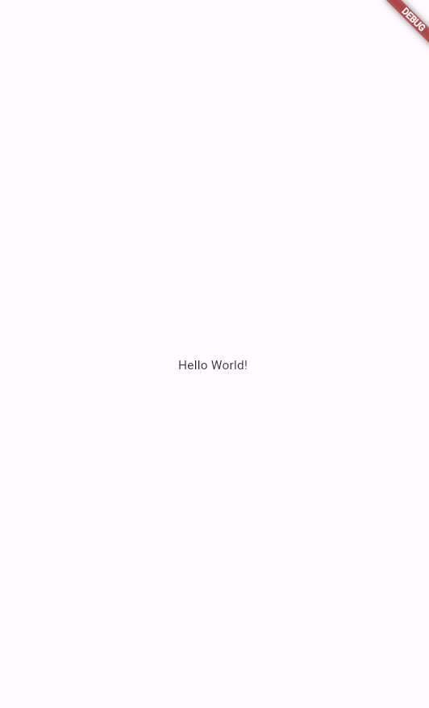
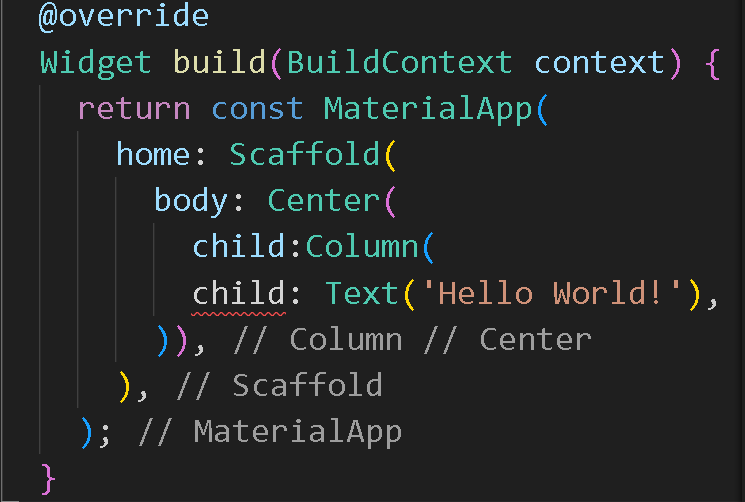
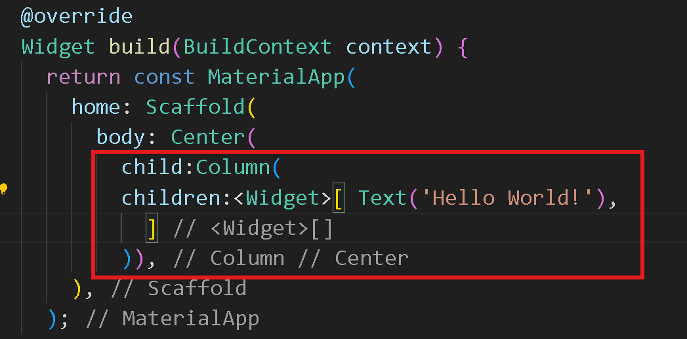
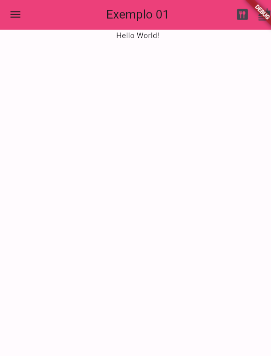

# exemplo01
 Projeto simples para demonstração de alguns Widgets.

Ao criar um projeto do tipo empty esse é o código inicial para os elementos, a partir dele serão realizadas algumas alterações.
````
 @override
  Widget build(BuildContext context) {
    return const MaterialApp(
      home: Scaffold(
        body: Center(
          child: Text('Hello World!'),
        ),
      ),
    );
  }
````
 

A primeira etapa a ser feita é edequar o código para que sejam inseridos novos elementos.
Para começar adicionaremos uma coluna (`Column`) ao layoute que irá permitir organizar os elementos verticalmente. Faremos isso adicionando a Tag dentro do elemento `body`.

Após a alteração, o element `child` que está dentro da coluna apresenta erro, isso acontece pois a coluna espera múltiplos elementos, dessa forma é nessário colocá-lo no plural, alterando para `children`. Além disso é necessário inserir um elemento Widget, que consiste em um vetor que conterá a lista dos elementos da coluna.


Após a alteração haverá uma pequena mudança no layout, com o texto no topo.


A aprtir de agora iremos adicionar novos elementos. Primeiro iremos incluir uma appbar. Para isso
 - Remover a tag `const` da declaração do Material
 - incluir a AppBar
 - customizar a AppBar (descrição nos comentários)
````
@override
  Widget build(BuildContext context) {
    return  MaterialApp(
      home: Scaffold(
        appBar: AppBar(
          //define o titulo da app
              title: const Text('Exemplo 01'),
              //centraliza o título
              centerTitle: true,
              //muda a cor do background
               backgroundColor: Colors.pink.shade400,
               //adicionar botões de ação antes do título
               leading: 
               IconButton(onPressed: () {} , icon:const Icon(Icons.menu),),
               //inclui os botões após o título
                actions: [
                  IconButton(onPressed: () {} , icon:const Icon(Icons.dining) ),
                  IconButton(onPressed: () {} , icon:const Icon(Icons.no_food) ),
                ],
                ),
        body: const Center(
          child:Column(
          children:<Widget>[ Text('Hello World!'),
            ]
          )),
      ),
    );
````
Resultado:



Para outras opções de design: [AppBar Flutter](https://howtoflutter.dev/widgets/appbar/)

